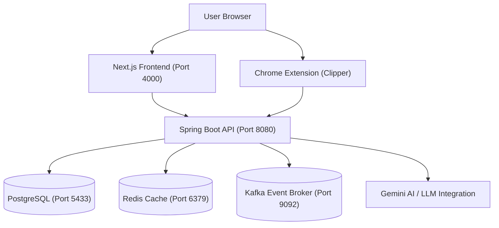

# Interview Copilot - Full-Stack AI Preparation Platform

Interview Copilot is a portfolio-grade, full-stack AI-powered platform designed to help software engineers prepare for technical interviews. It includes resume analysis, job matching heuristics, chat-based mock interviews, a system design coach, and a Kanban application tracker.

---

## 🏗️ System Architecture

The platform operates as a decoupled microservices-ready setup:



---

## 🛠️ Tech Stack

### Frontend
- **Framework**: Next.js 16 (App Router, TypeScript)
- **Styling**: Tailwind CSS & Modern Glassmorphism System
- **State Management**: Zustand & React Contexts
- **Icons**: Lucide React

### Backend
- **Framework**: Spring Boot 3 & Java 21
- **Security**: Spring Security + JWT Authentication
- **ORM & Database**: Spring Data JPA & PostgreSQL
- **Caching & Queue**: Redis & Apache Kafka
- **AI Core**: Google Gemini API Integration

---

## 🚀 Getting Started

### 1. Prerequisites
Ensure you have the following installed:
- **Docker & Docker Compose** (for PostgreSQL, Redis, and Kafka)
- **Java 21 JDK**
- **Node.js 18+** (with npm)

---

### 2. Infrastructure Setup (Docker)
Bootstrap the local databases and event broker containers:
```bash
# Navigate to the backend folder
cd backend

# Start the PostgreSQL, Redis, and Kafka containers
docker compose up -d
```
*Port mappings:*
- PostgreSQL runs on `5433` (Database: `interview_copilot`, Username: `postgres`, Password: `postgres`)
- Redis runs on `6379`
- Kafka runs on `9092`

---

### 3. Backend Setup (Spring Boot)
1. Environment variables and properties are pre-configured in `backend/src/main/resources/application.yml`.
2. Run the launcher script or Maven compile command to run the backend API server on port `8080`:
```bash
# From the backend directory:
./run.ps1
# or
mvn spring-boot:run
```

---

### 4. Frontend Setup (Next.js)
1. Install node dependencies in the root project directory:
```bash
# In the root directory:
npm install
```
2. Start the development server on port `4000`:
```bash
npm run dev
```
3. Open `http://localhost:4000` to access the application.

---

### 5. Browser Extension Setup (LinkedIn Clipper)
The extension lets you scrape jobs from LinkedIn and add them directly to your Kanban board.
1. Open Google Chrome and navigate to `chrome://extensions/`.
2. Enable **Developer mode** in the top-right corner.
3. Click **Load unpacked** in the top-left and select the `browser-extension` folder in this repository.
4. Log in directly via the extension popup using your registered local credentials.
5. Navigate to any LinkedIn job details page and click **Scrape** then **Save to Kanban Board**.

---

## 📂 Project Structure

```text
interview-copilot/
  ├── app/                  # Next.js app routes, layouts, and views
  ├── components/           # Reusable Next.js React UI components
  ├── lib/                  # Shared JS utilities, state stores, and API clients
  ├── backend/              # Spring Boot Java Application
  │    ├── src/             # Java codebases (controllers, services, entities)
  │    ├── run.ps1          # Powershell bootstrapping script
  │    └── docker-compose.yml # PostgreSQL, Redis, Kafka local setup
  ├── browser-extension/    # Chrome Extension Clipper files
  └── documentation/        # Development plan, database schemas, and architectural specs
```

---

## 📄 Documentation Links
Detailed structural and design decisions can be found in the `documentation` folder:
- [Development Plan & Phases](documentation/Plan.md)
- [Architecture & System Design](documentation/SystemDesign.md)
- [Auth Flow Specifications](documentation/auth_flow.md)
- [Database Entity Design](documentation/database_design.md)
- [Caching & Event Messaging Specs](documentation/caching_and_messaging.md)
