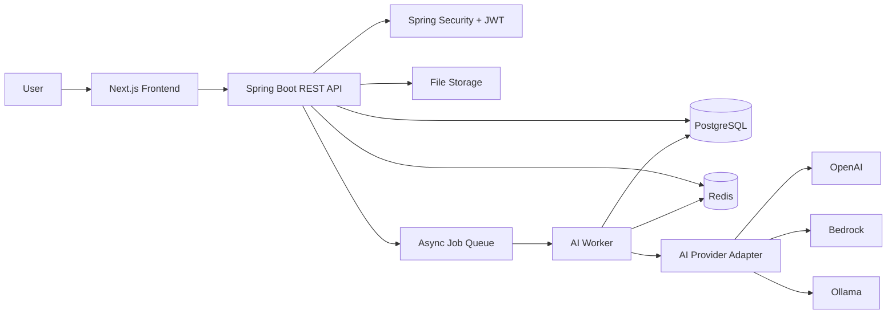
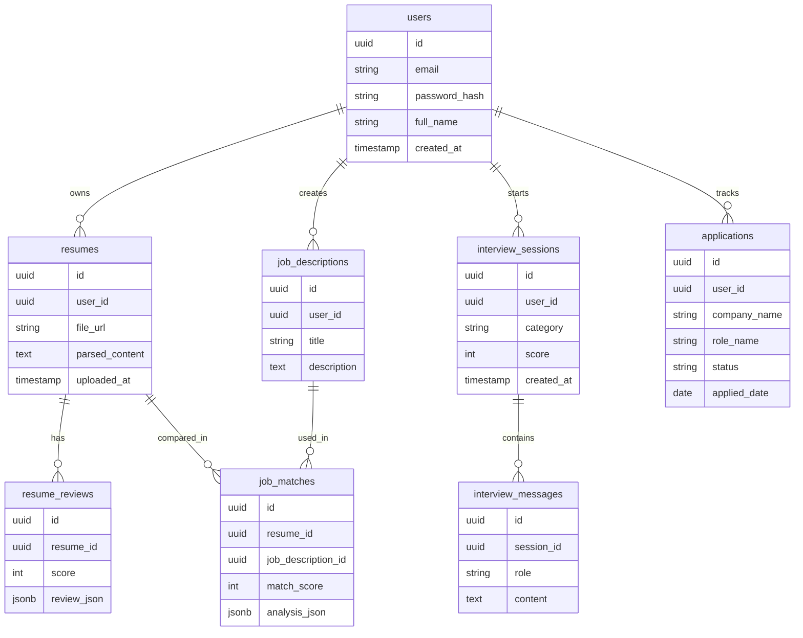
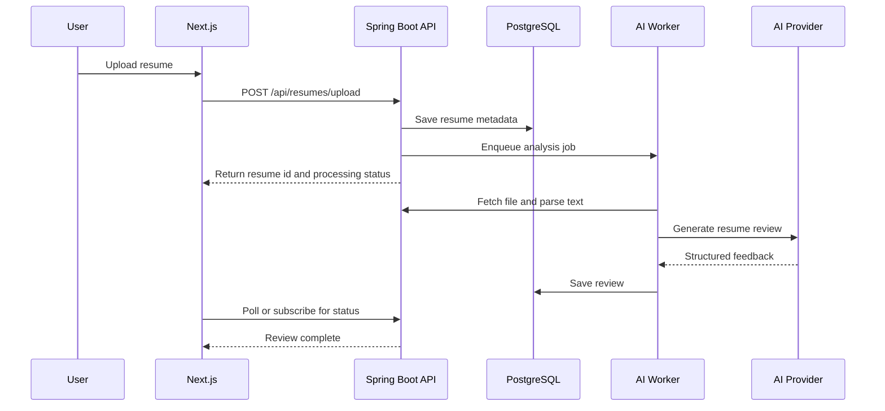
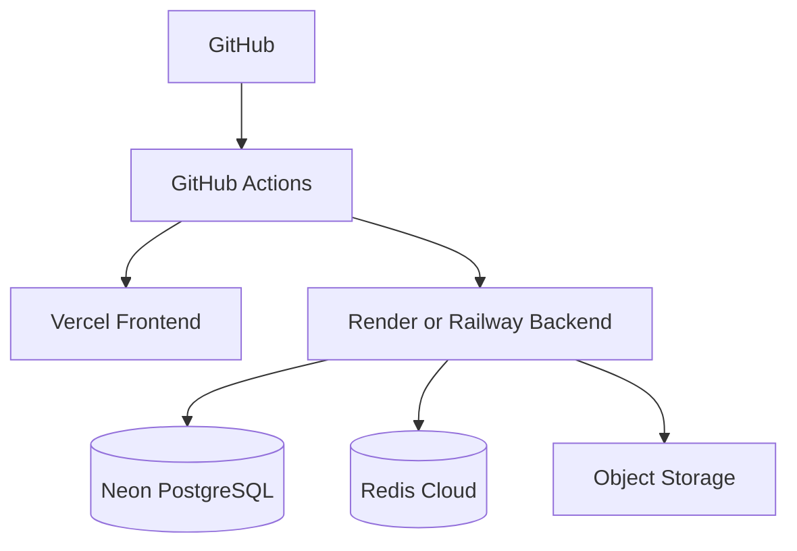

# Interview Copilot - System Design

## 1. Overview

Interview Copilot is an AI-powered preparation platform for software engineers. It helps users upload resumes, compare them with job descriptions, run mock interviews, practice system design, generate outreach messages, and track job applications.

The system is designed as a portfolio-grade full stack application:

- Next.js 16 frontend for the user experience
- Spring Boot 3 backend for API, auth, orchestration, and business logic
- PostgreSQL for durable user and workflow data
- Redis for caching, rate limiting, and short-lived session data
- AI provider abstraction for OpenAI, Bedrock, or Ollama
- Async workers for long-running resume analysis and interview evaluation

## 2. Goals

- Provide a polished recruiter-facing demo of a real product workflow.
- Demonstrate secure authentication and authorization.
- Support file upload and AI-based resume feedback.
- Compare resumes against job descriptions and produce actionable gaps.
- Run chat-style mock interviews with scoring and history.
- Practice system design interviews with structured AI guidance.
- Track applications through a kanban-style pipeline.
- Keep AI provider integration replaceable and testable.

## 3. Non-Goals For MVP

- Real-time voice interview streaming.
- Multi-tenant enterprise administration.
- Paid billing plans.
- Deep ATS integration with external job boards.
- Collaborative editing.

## 4. High-Level Architecture



## 5. Frontend Architecture

The frontend starts as a UI-first Next.js application so the product can be presented before backend implementation is complete.

### Main Areas

- App shell and authenticated dashboard
- Resume analyzer
- Job match analyzer
- Resume tailoring diff view
- Mock interview chat
- System design coach
- Job tracker kanban
- Profile and settings

### Frontend Responsibilities

- Render a polished product experience.
- Manage route-level layouts and responsive screens.
- Handle form validation before API submission.
- Store auth tokens safely.
- Call backend APIs through typed client modules.
- Use TanStack Query for server state.
- Use Redux Toolkit only for client workflow state that spans screens.
- Show async job progress and cached analysis results.

### Suggested Routes

| Route | Purpose |
| --- | --- |
| `/` | Public product entry or redirect to dashboard |
| `/login` | User login |
| `/register` | User registration |
| `/dashboard` | Main user overview |
| `/resumes` | Resume list and upload |
| `/resumes/:id` | Resume analysis details |
| `/jobs/match` | Job description comparison |
| `/interviews` | Interview sessions |
| `/interviews/:id` | Chat and evaluation view |
| `/system-design` | System design practice |
| `/applications` | Job tracker |

## 6. Backend Architecture

Spring Boot owns authentication, persistence, authorization, business workflows, AI orchestration, and observability.

### Suggested Modules

```text
com.interviewcopilot
  auth
  users
  resumes
  jobs
  interviews
  systemdesign
  applications
  ai
  files
  common
  config
```

### API Layer

Controllers expose REST endpoints and validate request shapes. They should avoid business logic and delegate to services.

### Service Layer

Services implement workflows such as:

- Register user
- Upload resume
- Parse resume
- Start resume review
- Compare resume with job description
- Start interview session
- Evaluate interview response
- Create application card

### Persistence Layer

Spring Data JPA repositories handle database access. Use DTO projections for read-heavy dashboard screens to avoid unnecessary entity loading.

## 7. Authentication And Authorization

### Flow

1. User registers with name, email, and password.
2. Backend hashes password with BCrypt.
3. User logs in and receives access and refresh tokens.
4. Frontend sends access token on protected API calls.
5. Backend validates token and loads user context.
6. Refresh token endpoint issues a new access token.

### Security Controls

- BCrypt password hashing
- JWT access tokens
- Refresh token rotation
- Role-based authorization
- Rate limiting for login and AI endpoints
- Request validation
- CORS restricted to deployed frontend URL
- File upload type and size checks

## 8. Database Design

### Core Tables



### Indexing

- `users.email` unique index
- `resumes.user_id`
- `resume_reviews.resume_id`
- `job_descriptions.user_id`
- `job_matches.resume_id`
- `job_matches.job_description_id`
- `interview_sessions.user_id, created_at`
- `applications.user_id, status`

## 9. AI Service Design

The backend uses an AI provider interface so the app can switch between OpenAI, Bedrock, and local Ollama without changing feature services.

```java
public interface AIProvider {
    String generate(String prompt);
}
```

### Provider Implementations

- `OpenAIProvider`
- `BedrockProvider`
- `OllamaProvider`

### AI Use Cases

| Feature | Prompt Input | Output |
| --- | --- | --- |
| Resume Review | Parsed resume text | Score, strengths, weaknesses, missing keywords |
| Job Match | Resume + job description | Match score, missing skills, recommendations |
| Resume Tailoring | Resume + job description | Improved bullets and keyword suggestions |
| Mock Interview | Category + conversation history | Next question and feedback |
| System Design Coach | Topic + answers so far | Guided next step and evaluation |
| Outreach Assistant | Company + role + context | Referral or recruiter message |

### Prompt Safety

- Keep system prompts server-side.
- Validate user input length.
- Strip unsupported file content.
- Use structured JSON output where possible.
- Store prompt versions for reproducible results.

## 10. Async Processing

AI and file parsing can take time, so long-running workflows should run as jobs.

### Resume Analysis Flow



### Job States

- `PENDING`
- `PROCESSING`
- `COMPLETED`
- `FAILED`

## 11. Caching Strategy

Redis is used for both performance and cost control.

### Cache Targets

- Resume review result by resume content hash
- Job match result by resume hash and job description hash
- System design challenge templates
- Dashboard summary counts
- Refresh token metadata
- Rate limit counters

### Cache Key Examples

```text
resume-review:{userId}:{resumeHash}:{promptVersion}
job-match:{userId}:{resumeHash}:{jobHash}:{promptVersion}
dashboard-summary:{userId}
rate-limit:login:{ip}
rate-limit:ai:{userId}
```

## 12. API Design

### Auth

```text
POST /api/auth/register
POST /api/auth/login
POST /api/auth/refresh
POST /api/auth/logout
GET  /api/users/me
PUT  /api/users/me
```

### Resume

```text
POST /api/resumes/upload
GET  /api/resumes
GET  /api/resumes/{id}
GET  /api/resumes/{id}/review
```

### Jobs

```text
POST /api/jobs/descriptions
GET  /api/jobs/descriptions
POST /api/jobs/matches
GET  /api/jobs/matches/{id}
```

### Interviews

```text
POST /api/interviews/start
POST /api/interviews/{id}/messages
GET  /api/interviews
GET  /api/interviews/{id}
```

### System Design

```text
POST /api/system-design/sessions
POST /api/system-design/sessions/{id}/messages
GET  /api/system-design/sessions/{id}/evaluation
```

### Applications

```text
POST /api/applications
GET  /api/applications
PUT  /api/applications/{id}
DELETE /api/applications/{id}
```

## 13. Deployment Design



### Environments

- Local: Docker Compose for PostgreSQL, Redis, backend, and frontend
- Staging: Deployed backend and database with seed/demo data
- Production: Public portfolio URL with real auth and protected user data

## 14. Observability

- Spring Boot Actuator health endpoints
- Structured request logging
- Correlation ID per request
- AI provider latency metrics
- Cache hit and miss metrics
- Error rate dashboard
- GitHub Actions build and test history

## 15. MVP Implementation Order

1. UI mockup with static data
2. Next.js routing and reusable UI components
3. Spring Boot project setup
4. PostgreSQL schema and migrations
5. Auth and user profile
6. Resume upload and parsing
7. AI provider abstraction
8. Resume review flow
9. Job match analyzer
10. Mock interview chat
11. System design coach
12. Deployment and demo documentation

## 16. Portfolio Talking Points

- Built a realistic full stack product rather than a toy CRUD app.
- Designed replaceable AI provider integration.
- Used Redis to reduce repeated AI calls and improve response times.
- Protected AI endpoints with auth and rate limiting.
- Modeled long-running AI workflows as async jobs.
- Used PostgreSQL JSONB for flexible AI analysis payloads.
- Designed the frontend around recruiter-visible workflows and demo clarity.
