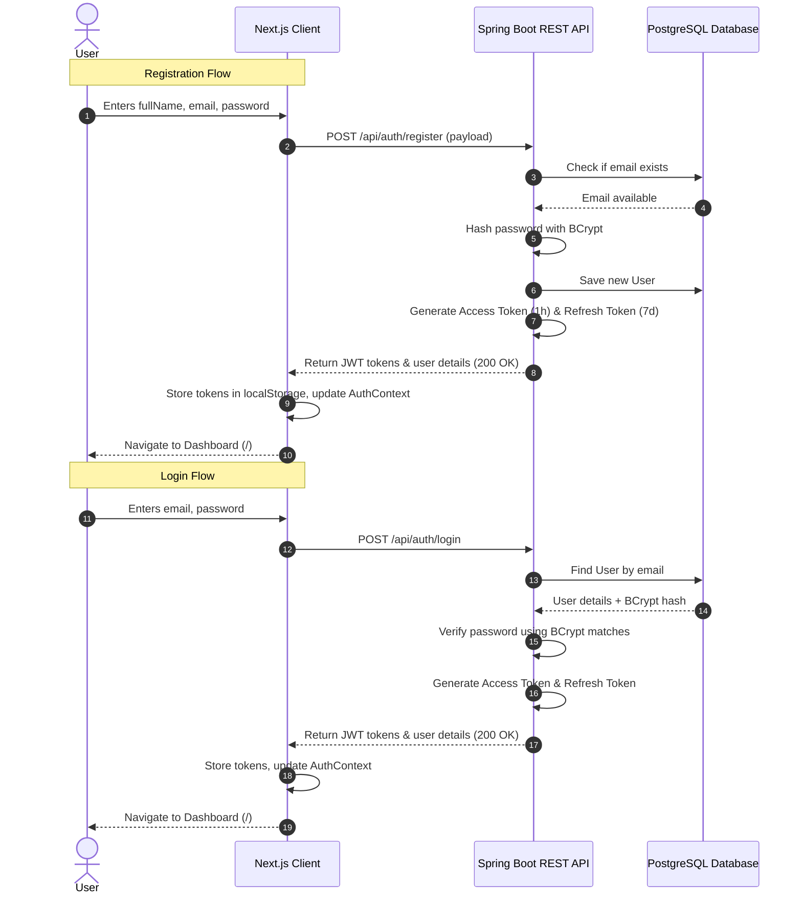

# Technical Documentation - Authentication & Authorization Flow

This document details the portfolio-grade full stack authentication and authorization design implemented for **Interview Copilot**.

---

## 1. Architectural Overview

The application utilizes a **Stateless JSON Web Token (JWT)** architecture to manage user identity and session persistence. 



---

## 2. Database Schema

User credentials are saved in the `users` PostgreSQL table. Password security is enforced using the **BCrypt hashing algorithm** with a secure cost factor (default 10).

### Table: `users`
| Column | Type | Constraints | Description |
| :--- | :--- | :--- | :--- |
| `id` | `UUID` | `PRIMARY KEY` | Globally unique identifier. Generated automatically using UUIDv4. |
| `email` | `VARCHAR` | `UNIQUE`, `NOT NULL` | The user's primary email address (acts as username). |
| `password_hash`| `VARCHAR` | `NOT NULL` | One-way BCrypt hash of the user's password. |
| `full_name` | `VARCHAR` | `NOT NULL` | User's full name. |
| `created_at` | `TIMESTAMP`| `NOT NULL` | Auto-populated on entity persist. |

An database index `idx_users_email` is applied to the `email` column to optimize login lookup times.

---

## 3. JWT Token Structure

Tokens are signed with a symmetric **HMAC-SHA256 (HS256)** key stored on the server.

### Access Token
- **Lifetime**: 1 hour (3600000 milliseconds)
- **Claims**:
  - `sub`: User's email address
  - `iat`: Token issuance timestamp
  - `exp`: Expiration timestamp

### Refresh Token
- **Lifetime**: 7 days (604800000 milliseconds)
- **Purpose**: Used by the frontend client to call `/api/auth/refresh` to obtain a fresh access token without prompting the user for credentials.

---

## 4. Backend Security Lifecycle (Spring Security)

The Spring Boot backend enforces security via a customized filter chain.

### Security Configurations (`SecurityConfig.java`)
1. **Stateless Sessions**: Sessions are configured as stateless (`SessionCreationPolicy.STATELESS`), meaning no HTTP session context is persisted on the server; the JWT is the sole bearer of user state.
2. **CORS Policy**: Configured to restrict origin requests explicitly to `http://localhost:3000` (the Next.js frontend). Allows headers like `Authorization` and `Content-Type` and supports credentials.
3. **Endpoint Authorization Matrix**:
   - `/api/auth/**`: Bypasses security filter (`permitAll`). Includes registration, login, and refresh.
   - `/**` (all other endpoints): Protected. Requires a valid JWT token.

```
Incoming Request
       │
       ▼
┌─────────────────────────────┐
│    CorsFilter (Checks)      │
└──────────────┬──────────────┘
               │
               ▼
┌─────────────────────────────┐
│  JwtAuthenticationFilter    │ ◄─── Parses "Authorization: Bearer <token>"
└──────────────┬──────────────┘      Validates JWT signature & expiration
               │                     Loads User details from Database
               │                     Populates SecurityContextHolder
               ▼
┌─────────────────────────────┐
│    AuthorizationFilter      │ ◄─── Blocks request if path is protected
└──────────────┬──────────────┘      and SecurityContext has no authenticated User
               │
               ▼
   Target REST Controller
```

---

## 5. Client-Side State Management (Next.js)

The React client coordinates authentication state and guards layouts using standard context API patterns.

### Reusable API Client (`lib/api.ts`)
- Prefixes all requests with the API Base URL (`http://localhost:8080`).
- Checks `localStorage` for `interview-copilot-token` and automatically appends it as a `Bearer` header.
- Monitors response codes:
  - If a **401 Unauthorized** error is returned (representing an expired or invalid token), it cleanses local storage tokens and dispatches an `auth-unauthorized` event to reset client states.

### Auth Provider Context (`components/AuthContext.tsx`)
- **State**:
  - `user`: Custom profile record `{ id, email, fullName }` or `null`.
  - `token`: String token or `null`.
  - `isAuthenticated`: Derived boolean.
  - `isLoading`: Boolean tracking if the system is parsing existing sessions.
- **On Mount**: Checks if an access token is in `localStorage`. If found, performs a validation call (`GET /api/users/me`). If successful, the user's profile is loaded; otherwise, the session is cleared.
- **Auto-Login**: When registering, the API returns a token immediately, which triggers the login pipeline, giving the user a seamless onboarding experience.

### Page Guards (`app/page.tsx`)
A `useEffect` hook monitors the authentication status. If the loading process completes and `isAuthenticated` is `false`, the client is automatically redirected using Next.js `useRouter` to `/login`.
Similarly, if an authenticated user accesses `/login` or `/register`, they are redirected back to the dashboard `/`.
