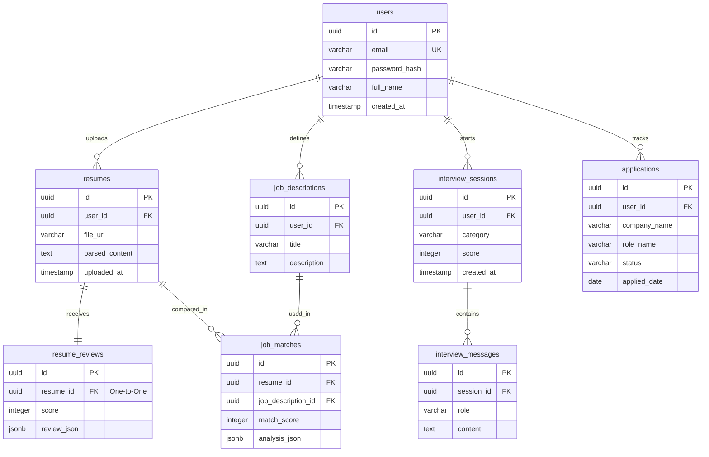

# Database Schema & Design Documentation

This document describes the database design for **Interview Copilot**, mapping relational structures, column definitions, index optimizations, and entity relationship diagrams.

---

## 1. Entity-Relationship Diagram (ERD)

The following diagram shows the logical relationships between the database tables.

---

## 2. Relational Schema Definitions

### 2.1 Table: `users`
Tracks registered user credentials and profiles.
- **Primary Key**: `id` (UUIDv4)
- **Indexes**:
  - `idx_users_email` (Unique): B-tree index on `email` (critical for lookup speed on registration/login).

| Column Name | Type | Constraints | Description |
| :--- | :--- | :--- | :--- |
| `id` | `UUID` | `PRIMARY KEY` | Globally unique identifier. |
| `email` | `VARCHAR(255)` | `UNIQUE`, `NOT NULL` | User email address. |
| `password_hash` | `VARCHAR(255)` | `NOT NULL` | Hashed password (BCrypt). |
| `full_name` | `VARCHAR(255)` | `NOT NULL` | Full display name. |
| `created_at` | `TIMESTAMP` | `NOT NULL` | Persistence timestamp. |

---

### 2.2 Table: `resumes`
Stores resume documents uploaded by users.
- **Primary Key**: `id` (UUIDv4)
- **Foreign Keys**:
  - `user_id` -> `users.id` (ON DELETE CASCADE)
- **Indexes**:
  - `idx_resumes_user_id`: B-tree index on `user_id` (optimizes parsing list queries per candidate).

| Column Name | Type | Constraints | Description |
| :--- | :--- | :--- | :--- |
| `id` | `UUID` | `PRIMARY KEY` | Unique resume identifier. |
| `user_id` | `UUID` | `FOREIGN KEY`, `NOT NULL` | Owner of the resume. |
| `file_url` | `VARCHAR(255)` | `NOT NULL` | Object storage link (S3/Cloudinary). |
| `parsed_content`| `TEXT` | `NULL` | Plain text content extracted from document. |
| `uploaded_at` | `TIMESTAMP` | `NOT NULL` | Timestamp. |

---

### 2.3 Table: `resume_reviews`
Maintains AI feedback and keyword recommendations for a specific resume.
- **Primary Key**: `id` (UUIDv4)
- **Foreign Keys**:
  - `resume_id` -> `resumes.id` (ON DELETE CASCADE, One-to-One)
- **Indexes**:
  - `idx_resume_reviews_resume_id`: B-tree index on `resume_id` (optimizes search).

| Column Name | Type | Constraints | Description |
| :--- | :--- | :--- | :--- |
| `id` | `UUID` | `PRIMARY KEY` | Unique review identifier. |
| `resume_id` | `UUID` | `FOREIGN KEY`, `NOT NULL` | Target resume being evaluated. |
| `score` | `INTEGER` | `NOT NULL` | Cumulative ATS readiness score (0-100). |
| `review_json` | `JSONB` | `NOT NULL` | Semi-structured data storing strengths, gaps, and bullets. |

---

### 2.4 Table: `job_descriptions`
Contains job details pasted by users for keyword alignment comparisons.
- **Primary Key**: `id` (UUIDv4)
- **Foreign Keys**:
  - `user_id` -> `users.id` (ON DELETE CASCADE)
- **Indexes**:
  - `idx_job_desc_user_id`: B-tree index on `user_id`.

| Column Name | Type | Constraints | Description |
| :--- | :--- | :--- | :--- |
| `id` | `UUID` | `PRIMARY KEY` | Unique description ID. |
| `user_id` | `UUID` | `FOREIGN KEY`, `NOT NULL` | Author user. |
| `title` | `VARCHAR(255)` | `NOT NULL` | Job title (e.g. Senior Software Engineer). |
| `description` | `TEXT` | `NOT NULL` | Core job description and qualifications text. |

---

### 2.5 Table: `job_matches`
Tracks the scores and breakdown details comparing a resume against a job description.
- **Primary Key**: `id` (UUIDv4)
- **Foreign Keys**:
  - `resume_id` -> `resumes.id` (ON DELETE CASCADE)
  - `job_description_id` -> `job_descriptions.id` (ON DELETE CASCADE)
- **Indexes**:
  - `idx_job_matches_resume_id`
  - `idx_job_matches_jd_id`

| Column Name | Type | Constraints | Description |
| :--- | :--- | :--- | :--- |
| `id` | `UUID` | `PRIMARY KEY` | Unique comparison match ID. |
| `resume_id` | `UUID` | `FOREIGN KEY`, `NOT NULL` | Compared resume. |
| `job_description_id` | `UUID` | `FOREIGN KEY`, `NOT NULL` | Compared job description. |
| `match_score` | `INTEGER` | `NOT NULL` | Final match compatibility rating (0-100). |
| `analysis_json` | `JSONB` | `NOT NULL` | Detailed matching details (missing skills, recommendations). |

---

### 2.6 Table: `interview_sessions`
Represents technical or behavioral interactive mock interview logs.
- **Primary Key**: `id` (UUIDv4)
- **Foreign Keys**:
  - `user_id` -> `users.id` (ON DELETE CASCADE)
- **Indexes**:
  - `idx_int_sessions_user_id`: Compound index on `user_id, created_at` (orders history pages quickly).

| Column Name | Type | Constraints | Description |
| :--- | :--- | :--- | :--- |
| `id` | `UUID` | `PRIMARY KEY` | Session key. |
| `user_id` | `UUID` | `FOREIGN KEY`, `NOT NULL` | Practicing user. |
| `category` | `VARCHAR(255)` | `NOT NULL` | Interview category (e.g. Java, System Design). |
| `score` | `INTEGER` | `NULL` | Evaluation score (0-10) populated upon completion. |
| `created_at` | `TIMESTAMP` | `NOT NULL` | Session start timestamp. |

---

### 2.7 Table: `interview_messages`
Stores the individual message turn history for a chat session.
- **Primary Key**: `id` (UUIDv4)
- **Foreign Keys**:
  - `session_id` -> `interview_sessions.id` (ON DELETE CASCADE)
- **Indexes**:
  - `idx_int_msgs_session_id`: B-tree index on `session_id` (reconstructs history chronologically).

| Column Name | Type | Constraints | Description |
| :--- | :--- | :--- | :--- |
| `id` | `UUID` | `PRIMARY KEY` | Message ID. |
| `session_id` | `UUID` | `FOREIGN KEY`, `NOT NULL` | Owning session context. |
| `role` | `VARCHAR(50)` | `NOT NULL` | Role of sender: `AI` or `USER`. |
| `content` | `TEXT` | `NOT NULL` | Plain text message. |

---

### 2.8 Table: `applications`
Tracks user job application status card movements on the Kanban pipelines.
- **Primary Key**: `id` (UUIDv4)
- **Foreign Keys**:
  - `user_id` -> `users.id` (ON DELETE CASCADE)
- **Indexes**:
  - `idx_applications_user_status`: Compound index on `user_id, status` (renders boards and columns efficiently).

| Column Name | Type | Constraints | Description |
| :--- | :--- | :--- | :--- |
| `id` | `UUID` | `PRIMARY KEY` | Card ID. |
| `user_id` | `UUID` | `FOREIGN KEY`, `NOT NULL` | Owner of pipeline. |
| `company_name` | `VARCHAR(255)` | `NOT NULL` | Target employer name. |
| `role_name` | `VARCHAR(255)` | `NOT NULL` | Title of job. |
| `status` | `VARCHAR(255)` | `NOT NULL` | Kanban column (`Saved`, `Applied`, `Technical Round`, etc.). |
| `applied_date` | `DATE` | `NULL` | Date of submission. |

---

## 3. Database Design Patterns & Best Practices

### 3.1 Hiding Semi-structured AI Data (JSONB)
AI response payloads (for resume reviews and job matching compatibility summaries) can vary heavily based on prompt engineering or model versioning. Storing this dynamically inside PostgreSQL `JSONB` columns allows:
- Schema flexibility (adding or removing summary fields doesn't require database migrations).
- Native query support (PostgreSQL enables indexing and looking up fields inside JSON keys using JSON operators).

### 3.2 Index Optimization Strategies
1. **Single-Column Indexes**: High-cardinality foreign keys (`resume_id`, `session_id`) and search targets (`email`) have dedicated indexes.
2. **Compound Indexes**: Filters that query on multiple criteria (like displaying Kanban cards matching a specific `user_id` AND `status`) use compound indexes (`idx_applications_user_status`) to execute index-only scans, avoiding sorting overhead in memory.
