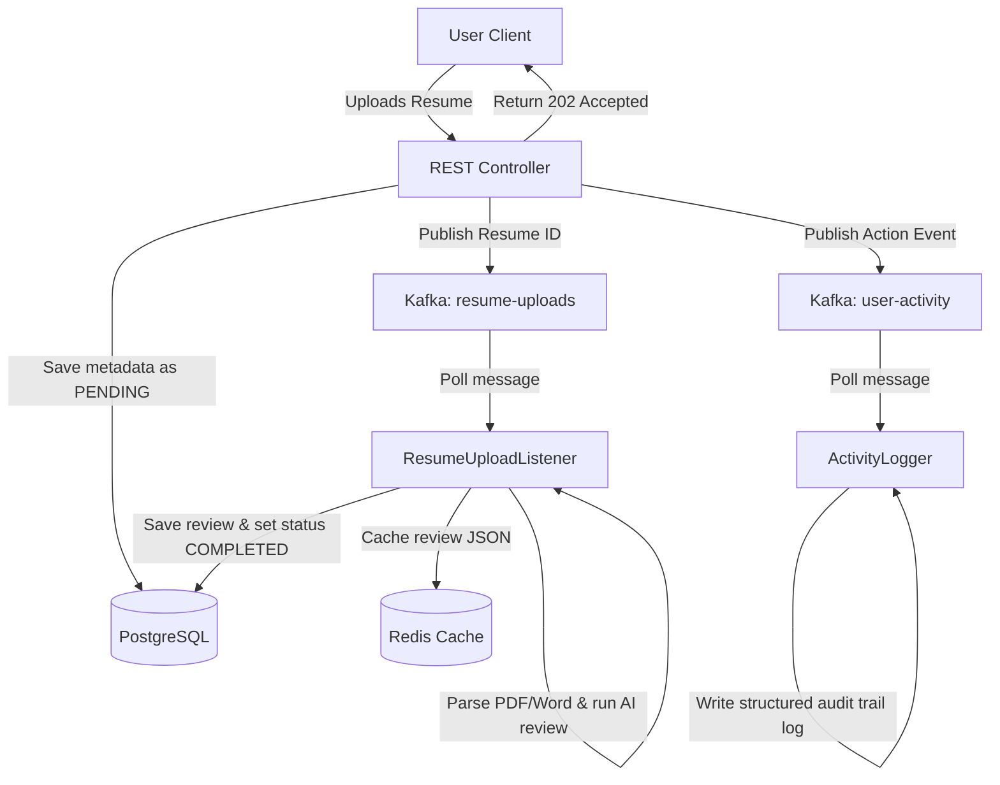

# Caching & Messaging Architecture (Redis & Kafka)

This document describes how **Redis** and **Apache Kafka** are integrated into the **Interview Copilot** backend for sub-millisecond caching and asynchronous, decoupled event-driven workflows.

---

## 1. Architectural Diagram



---

## 2. Redis Caching Strategy

We use **Redis** to store computationally heavy and slow data results to keep subsequent read requests under 10ms.

### Cache Targets & Key Formatting:
1. **Resume Reviews**:
   - **Key**: `resume-review:{resumeId}`
   - **Value**: JSON String (comprehensive scorecard output from Gemini).
   - **Invalidation**: Deleted when a resume is deleted.
2. **Mock Interview Scorecards**:
   - **Key**: `interview-evaluation:{sessionId}`
   - **Value**: JSON String (dynamic AI analysis of the transcript).

### Cache Flow:
```java
String cacheKey = "interview-evaluation:" + sessionId;
String cachedValue = redisTemplate.opsForValue().get(cacheKey);

if (cachedValue != null) {
    return cachedValue; // Sub-millisecond return
}

// Cache Miss -> query Gemini AI or DB
String result = evaluateSessionWithAI(sessionId);

// Populate Cache
redisTemplate.opsForValue().set(cacheKey, result);
```

---

## 3. Kafka Message Queue Flows

We use **Apache Kafka** to manage asynchronous tasks and publish activity streams without blocking HTTP user requests.

### 3.1 Topic: `resume-uploads`
- **Purpose**: Offloads PDF parsing and Gemini resume analysis to background worker threads.
- **Producer**: `ResumeController` / `ResumeService` publishes the Resume ID immediately after writing the file to disk.
- **Consumer**: `ResumeUploadListener` processes the parsing and Gemini analysis asynchronously, updating the status from `PENDING` -> `PROCESSING` -> `COMPLETED`.

### 3.2 Topic: `user-activity`
- **Purpose**: Provides a durable, decoupled audit logging stream of user actions for analytics.
- **Producer**: Triggered in core services upon important user events.
  - Events tracked:
    - `RESUME_UPLOADED`
    - `INTERVIEW_STARTED`
    - `INTERVIEW_ANSWER_SUBMITTED`
    - `INTERVIEW_EVALUATED`
    - `SYSTEM_DESIGN_EVALUATED`
- **Consumer**: `ActivityLogger` parses the JSON activity structure and outputs a structured log trace suitable for downstream monitoring dashboards.

---

## 4. Local Deployment Configuration

Both services are configured inside the docker layout.

### Docker Compose Services:
- **Redis**: Runs on default port `6379`.
- **Kafka**: Runs in KRaft mode (no ZooKeeper wrapper) on port `9092` with the `bitnami/kafka` container.

### Spring Boot Properties (`application.yml`):
```yaml
spring:
  data:
    redis:
      host: localhost
      port: 6379
  kafka:
    bootstrap-servers: localhost:9092
    consumer:
      group-id: interview-copilot-group
      auto-offset-reset: earliest
```
